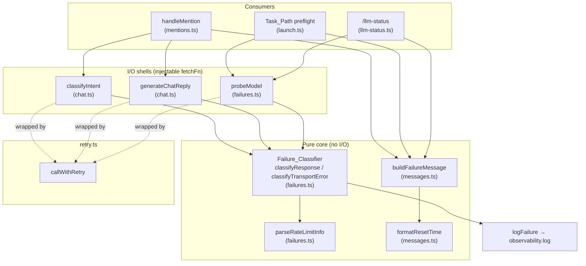
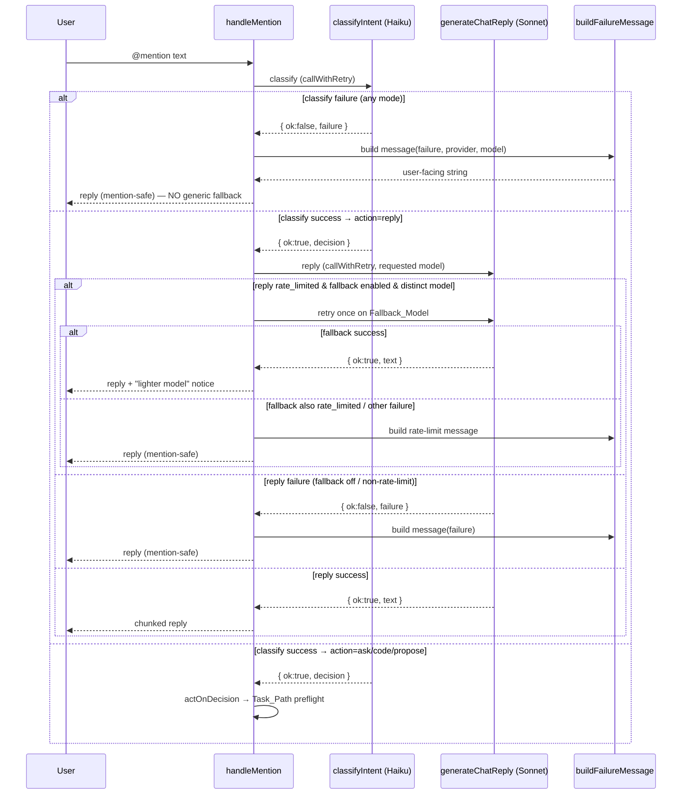
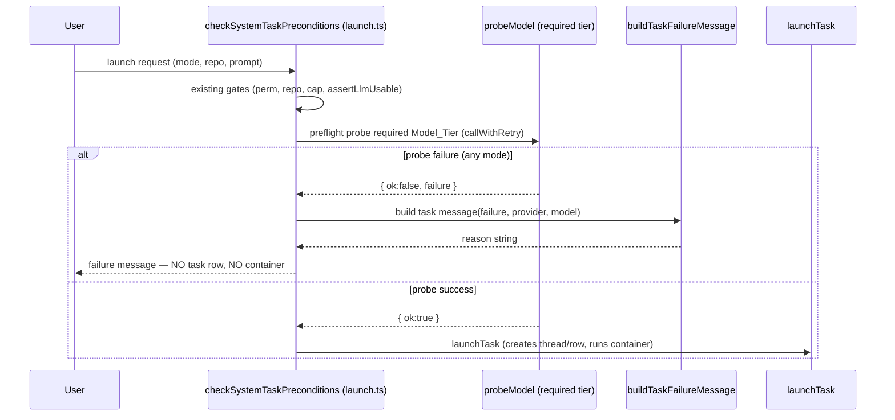

# Design Document

## Overview

Today every non-200 response from the Anthropic Messages API is swallowed into a generic string, and `classifyIntent` silently degrades to a canned reply decision. Live diagnosis confirmed the real-world failure: a guild on a Claude Pro/Max subscription token (`claude_oauth`) still gets HTTP 200 from `claude-haiku-4-5` (the classifier model) but HTTP 429 `rate_limit_error` from `claude-sonnet-4-6` and `claude-opus-4-8` (the reply/task models). The classifier succeeds, the reply fails, and the user sees "Sorry, I couldn't generate a response" — a recoverable, time-bounded throttle dressed up as a total outage.

This feature makes the bot resilient and transparent under rate-limit and other distinct LLM failure modes across both the **Chat_Path** (`@mention` → classify → reply) and the **Task_Path** (`/ask`, `/code` launches). The core idea is to introduce a single **Failure_Classifier** — a pure function that maps an HTTP response or transport error into exactly one of `success | rate_limited | auth_failed | overloaded | model_error | network_error` — and route every LLM call through it. Downstream, a pure **message-builder** turns a classified failure plus provider context into an actionable, mention-safe Discord string, with Discord timestamp formatting for recovery times. Optional model-tier fallback, bounded single-retry/backoff, structured observability, and an admin `/llm-status` command round out the feature.

The design deliberately favors **pure, injectable, unit-testable functions** (classifier, header parser, message builder) wrapped by thin I/O shells (the existing `classifyIntent`/`generateChatReply` with their injectable `fetchFn`). This keeps the risky logic — status mapping, header parsing with clamping/bounds, message safety, secret redaction — fully covered by property-based tests, while the network edges stay covered by the existing fetch-injection unit tests.

### Requirement coverage map

| Requirement | Where satisfied |
|---|---|
| 1 — Classify failure modes | `failures.ts` `classifyResponse` / `classifyTransportError` (new) |
| 2 — Extract rate-limit metadata | `failures.ts` `parseRateLimitInfo` (new) |
| 3 — Chat-path rate-limit messages | `messages.ts` `buildFailureMessage` + `handleMention` rewrite |
| 4 — Chat-path non-rate-limit messages | `messages.ts` `buildFailureMessage` |
| 5 — Task-path failure messages | `messages.ts` + `launch.ts` preflight |
| 6 — Optional chat fallback | `chat.ts` `generateChatReply` + `handleMention` fallback branch |
| 7 — Provider-type-aware messaging | `messages.ts` (provider param) |
| 8 — Coherent classify-vs-reply handling | `handleMention` rewrite |
| 9 — Retry/backoff | `retry.ts` `callWithRetry` (new) wrapping classify + reply + probe |
| 10 — Observability | `failures.ts` `logFailure` using `observability.ts` |
| 11 — Admin LLM status command | `llm-status.ts` (new) + `commands.ts` + `interactions.ts` |
| Config additions | `config.ts` (new zod fields) + `.env.example` |

## Architecture

### Module layout

```
apps/bot/src/llm/
  failures.ts        (NEW) Failure_Classifier, RateLimitInfo parsing, logFailure
  failures.test.ts   (NEW) unit + property tests for classifier & header parsing
  messages.ts        (NEW) pure message-builder (chat + task), Discord timestamp fmt
  messages.test.ts   (NEW) unit + property tests for mention-safety/truncation
  retry.ts           (NEW) callWithRetry: bounded single-retry/backoff wrapper
  retry.test.ts      (NEW)
  chat.ts            (MODIFIED) classifyIntent/generateChatReply return LlmCallResult
  chat.test.ts       (MODIFIED) assert structured results instead of strings
  credentials.ts     (unchanged; buildAnthropicHeaders reused by probe + status)
apps/bot/src/discord/
  mentions.ts        (MODIFIED) handleMention branches on classify/reply results
  launch.ts          (MODIFIED) Task_Path preflight probe before launchTask
  llm-status.ts      (NEW) /llm-status command handler + per-guild probe cache
  commands.ts        (MODIFIED) register /llm-status slash command
  interactions.ts    (MODIFIED) dispatch /llm-status
apps/bot/src/
  config.ts          (MODIFIED) new zod fields
  observability.ts   (unchanged; log + captureError reused)
```

The Failure_Classifier and message-builder are **leaf modules** with no Discord or DB dependencies, so they import cleanly into both paths and into tests without mocking the world.

### Component diagram



### Data flow — Chat_Path (`@mention`)



### Data flow — Task_Path (`/ask`, `/code`, and mention-routed tasks)



## Components and Interfaces

### 1. Failure_Classifier (`apps/bot/src/llm/failures.ts`, new)

A pure module. No `fetch`, no DB, no Discord. It accepts already-resolved primitives (status, a header lookup, body text/JSON) so it is trivially unit-testable and deterministic.

```ts
/** Wall-clock instant the classifier ran against (epoch ms). Injected so
 *  Reset_Time derivation and clamping are deterministic in tests. */
export interface ClassifyClock { nowMs: number; }

/** Minimal header view — case-insensitive getter, matching fetch Headers. */
export type HeaderGet = (name: string) => string | null;

/** Classify a completed HTTP response. `body` is the parsed JSON (or null if
 *  it failed to parse); `status` and `headers` come from the fetch Response. */
export function classifyResponse(args: {
  status: number;
  headers: HeaderGet;
  body: unknown;               // parsed JSON or null
  receivedAtMs: number;        // when the response was received
}): LlmCallResult;

/** Classify a thrown transport error (no HTTP status was received). */
export function classifyTransportError(err: unknown): LlmFailure & { mode: "network_error" };

/** Parse Anthropic rate-limit headers into Rate_Limit_Info. Pure. */
export function parseRateLimitInfo(args: {
  headers: HeaderGet;
  receivedAtMs: number;
}): RateLimitInfo;

/** Emit exactly one structured log line for a classified failure (Req 10). */
export function logFailure(failure: LlmFailure, fields: FailureLogFields): void;

/** Thin I/O shell that performs one Messages-API call and classifies it.
 *  Reused by the Task_Path preflight and /llm-status. Never throws. */
export async function probeModel(args: {
  auth: LlmAuth;
  model: string;
  fetchFn?: typeof fetch;
  timeoutMs: number;           // per-probe timeout (Req 1.9, Req 11.2)
  nowMs?: () => number;
}): Promise<LlmCallResult>;
```

**Status → mode mapping (Req 1):**

| Condition | Result |
|---|---|
| 200 + conformant body | `success` |
| 200 + non-conformant body / provider error indicator | `model_error` (1.7) |
| 429 | `rate_limited` (1.1) |
| 401, 403 | `auth_failed` (1.2) |
| 529 | `overloaded` (1.3) |
| 500–599 except 529 | `overloaded` (1.4) |
| 400–499 except 401/403/429 | `model_error` (1.5) |
| any other received status | `model_error` (1.8) |
| transport error / timeout (no status) | `network_error` (1.9) |

"Conformant body" is path-specific: the classifier takes a `validate: (body) => boolean` predicate so the classify path checks for a `tool_use` `decide` block and the reply path checks for a non-empty `text` block. A 200 that fails the predicate (or whose body carries `{"type":"error"}`) maps to `model_error` (1.7). The mapping is total and mutually exclusive by construction — a single `if/else if` ladder over disjoint status ranges with an unconditional final `model_error` arm, plus the separate transport-error entry point (1.10).

**Rate-limit header parsing (Req 2):** see Data Models for `RateLimitInfo`. Algorithm:
1. Read `anthropic-ratelimit-unified-reset`. If it parses as a non-negative integer, `resetTimeMs = value * 1000` (2.1). Otherwise treat as absent and fall through (2.2).
2. On fallthrough, read `retry-after`. If a non-negative integer, clamp to `[0, 86400]` seconds and `resetTimeMs = receivedAtMs + bounded * 1000` (2.3).
3. If neither usable, `resetTimeMs = null` (2.5).
4. If `resetTimeMs < receivedAtMs`, clamp `resetTimeMs = receivedAtMs` (2.6).
5. Read `anthropic-ratelimit-unified-status`; if present, include it truncated to 256 chars (2.4).

### 2. `chat.ts` refactor (modified)

`classifyIntent` and `generateChatReply` change their return type from `IntentDecision` / `string` to structured results. The injectable `fetchFn` and the `tool_use` parsing are preserved.

```ts
export type ClassifyResult =
  | { ok: true; decision: IntentDecision }
  | { ok: false; failure: LlmFailure };

export type ReplyResult =
  | { ok: true; text: string }
  | { ok: false; failure: LlmFailure };

export async function classifyIntent(
  auth: LlmAuth, chatModel: string, ctx: ChatContext,
  opts?: { fetchFn?: typeof fetch; timeoutMs?: number; nowMs?: () => number },
): Promise<ClassifyResult>;

export async function generateChatReply(
  auth: LlmAuth, model: string, ctx: ChatContext,
  opts?: { fetchFn?: typeof fetch; timeoutMs?: number; nowMs?: () => number },
): Promise<ReplyResult>;
```

Internally each builds its request (unchanged), `await`s `fetchFn`, parses JSON (guarding parse errors → treated as a 200-with-non-conformant-body when status is 200), and delegates to `classifyResponse`. On a 200 with a valid `decide` tool_use, classify returns `{ ok: true, decision }`. The old `FALLBACK` constant and the generic "couldn't generate a response" strings are **removed** — callers now own all user-facing copy via the message-builder, which is what kills the misleading generic fallback (Req 8.2–8.5).

### 3. Message-builder (`apps/bot/src/llm/messages.ts`, new)

Pure functions. No Discord client, no I/O. Output is a plain string the caller posts via the existing mention-safe `reply()` helper.

```ts
export interface MessageContext {
  failure: LlmFailure;
  providerType: LlmAuth["type"] | "unknown";
  customModelName?: string | null;   // for provider "custom" (Req 7.3/7.4)
}

/** Chat_Path message for any non-success failure (Req 3, 4, 7). */
export function buildChatFailureMessage(ctx: MessageContext): string;

/** Task_Path message for any non-success failure (Req 5, 7). */
export function buildTaskFailureMessage(ctx: MessageContext): string;

/** "Reply produced by a lighter model due to rate limits" prefix (Req 6.4). */
export function lighterModelNotice(): string;

/** Discord timestamp helpers. absolute=<t:EPOCH:F>, relative=<t:EPOCH:R>. */
export function formatResetTime(resetTimeMs: number): { absolute: string; relative: string };

/** Final safety pass applied to EVERY built message before return:
 *  strips @everyone/@here and <@..>/<@&..>/@ syntax, then truncates to 2000
 *  chars preserving the rate-limit statement + Reset_Time (Req 3.4, 3.6, 4.6, 5.8). */
export function sanitizeUserMessage(s: string, preserveTail?: string): string;
```

Mention-safety is enforced two ways (defense in depth): (a) `sanitizeUserMessage` neutralizes mention tokens in the string itself (`@everyone`→`@\u200beveryone`, `<@` → `<@\u200b`), and (b) the caller's `reply()` already sets `allowedMentions: { parse: [], repliedUser: true }` (Req 3.5, 4.7). Truncation preserves a `preserveTail` fragment (the "hit its usage/rate limit" sentence plus the Reset_Time) by trimming from the middle when the body would exceed 2000 chars (Req 3.6).

Provider-aware text (Req 7): for `claude_oauth` rate-limit messages, append the subscription note ("subscription credentials exhaust heavier models before lighter ones"). For `anthropic_api_key`, omit subscription text. For `custom`, reference `customModelName` (or generic wording if unset) and never name an Anthropic tier. For `unknown`, omit all provider/subscription specifics.

### 4. Retry/backoff (`apps/bot/src/llm/retry.ts`, new)

One place so classify, reply, and probe all share identical semantics (Req 9).

```ts
export interface RetryPolicy {
  maxRetryDelayMs: number;     // from config RETRY_MAX_DELAY_SECONDS
  sleep?: (ms: number) => Promise<void>;  // injectable for tests
}

/** Calls `attempt` once; on a `rate_limited` result, retries at most once,
 *  honoring retry-after, skipping if the wait exceeds maxRetryDelayMs.
 *  Never retries auth_failed/model_error; never auto-retries
 *  overloaded/network_error. Returns the final LlmCallResult. */
export async function callWithRetry(
  attempt: () => Promise<LlmCallResult>,
  policy: RetryPolicy,
): Promise<LlmCallResult>;
```

Decision table for the first result:

| First result | Action |
|---|---|
| `success` | return immediately |
| `rate_limited`, `retryAfterMs` present, `retryAfterMs ≤ maxRetryDelayMs` | sleep `retryAfterMs`, retry once, return second result (9.1, 9.2) |
| `rate_limited`, no `retryAfterMs` | retry once immediately, return second result (9.3) |
| `rate_limited`, `retryAfterMs > maxRetryDelayMs` | skip retry, return first result (9.4) |
| `auth_failed`, `model_error` | return immediately, never retry (9.5) |
| `overloaded`, `network_error` | return immediately, no auto-retry (9.6) |

`retryAfterMs` for backoff purposes comes only from the `retry-after` header (not from `unified-reset`), matching Req 9.2/9.3 wording. Retry count is per LLM call (classify and reply each get their own single retry — Req 9.1).

### 5. `handleMention` rewrite (`mentions.ts`, modified)

The orchestration becomes an explicit branch on structured results (Req 8). Pseudocode:

```ts
const providerType = llm.auth.type;
const classify = await callWithRetry(
  () => classifyIntent(llm.auth, ctx.config.CHAT_MODEL, chatCtx, { ...opts }),
  policy);
if (!classify.ok) {
  // Req 8.3/8.4 — one message, no reply gen, no generic fallback
  await reply(message, buildChatFailureMessage({ failure: classify.failure, providerType, customModelName }));
  return;
}
const decision = classify.decision;
if (decision.action === "reply") {
  let reply1 = await callWithRetry(() => generateChatReply(llm.auth, ctx.config.DEFAULT_MODEL, chatCtx, opts), policy);
  if (!reply1.ok && reply1.failure.mode === "rate_limited"
      && ctx.config.CHAT_FALLBACK_ENABLED
      && ctx.config.CHAT_FALLBACK_MODEL
      && ctx.config.CHAT_FALLBACK_MODEL !== ctx.config.DEFAULT_MODEL) {
    const fb = await callWithRetry(() => generateChatReply(llm.auth, ctx.config.CHAT_FALLBACK_MODEL, chatCtx, opts), policy);
    if (fb.ok) {
      for (const chunk of chunkText(lighterModelNotice() + fb.text, 1900)) await reply(message, chunk);
      return;
    }
    reply1 = fb; // fall through to rate-limit message (Req 6.6)
  }
  if (reply1.ok) { for (const chunk of chunkText(reply1.text, 1900)) await reply(message, chunk); return; }
  await reply(message, buildChatFailureMessage({ failure: reply1.failure, providerType, customModelName }));
  return;
}
// ask/code/propose → actOnDecision (Task_Path preflight handles failures)
await actOnDecision(...);
```

### 6. Task_Path preflight (`launch.ts`, modified)

`checkSystemTaskPreconditions` already calls `resolveLlmAuth` + `assertLlmUsable` and returns `{ ok, reason }`. We add **one preflight probe** of the required Model_Tier (`CODE_MODEL` for `/code`, `DEFAULT_MODEL` for `/ask`) **after** the existing gates and **before** repo/cap resolution and `launchTask`, so no thread or task row is created on failure (Req 5.7, 8.6):

```ts
const usable = await assertLlmUsable(ctx, guild, llmRes);
if (!usable.ok) return usable;
const requiredModel = mode === "code" ? ctx.config.CODE_MODEL : ctx.config.DEFAULT_MODEL;
const probe = await callWithRetry(
  () => probeModel({ auth: llmRes.auth, model: requiredModel, timeoutMs: ctx.config.CLASSIFIER_TIMEOUT_SECONDS * 1000 }),
  policy);
if (!probe.ok) {
  return { ok: false, reason: buildTaskFailureMessage({ failure: probe.failure, providerType: llmRes.auth.type, customModelName }) };
}
```

**Tradeoff (preflight probe vs. relying on `assertLlmUsable`):** `assertLlmUsable` is a local kill-switch check and cannot observe a 429 on a heavier tier — the exact live failure. A preflight probe is the only way to detect a rate-limited *required* model before paying the cost of a container launch. The probe is a `max_tokens: 1` Messages-API call (cheap, ~one extra round-trip) and reuses `buildAnthropicHeaders`. **Recommendation: probe.** A wasted runner launch (Docker container, git clone, agent boot) costs far more than one tiny request, and Req 5.7/8.6 require that we never create a task row on a rate-limited credential — which a probe is the cleanest way to guarantee. To bound added latency the probe honors `CLASSIFIER_TIMEOUT_SECONDS` and a single retry only.

### 7. Admin `/llm-status` command (`llm-status.ts`, new)

```ts
/** In-memory per-guild probe cache (Req 11.5). Module-scoped map. */
interface ProbeCacheEntry { atMs: number; providerType: string; tiers: TierProbe[]; }
interface TierProbe { tier: "chat" | "default" | "code"; model: string; result: LlmCallResult; }
const probeCache = new Map<string, ProbeCacheEntry>();
const PROBE_CACHE_TTL_MS = 60_000;

export async function handleLlmStatusCommand(ctx: BotContext, interaction: ChatInputCommandInteraction): Promise<void>;
```

Flow:
1. Admin gate: `interaction.memberPermissions?.has("ManageGuild")` (mirrors `handleConfig`). On failure, reply "Admin permission required" and **do not probe** (Req 11.4).
2. If a cache entry for this guild is < 60s old, render it without probing (Req 11.5).
3. Otherwise resolve auth, probe each configured Model_Tier (`CHAT_MODEL`, `DEFAULT_MODEL`, `CODE_MODEL`) via `probeModel` with `timeoutMs = 10_000` (Req 11.2), each wrapped once by `callWithRetry`, store in cache.
4. Render an ephemeral report: provider type (Req 11.1), per-tier success/Failure_Mode, and for `rate_limited` tiers with a Reset_Time, the human-friendly `formatResetTime` output (Req 11.3). The renderer reuses `sanitizeUserMessage` and never includes the token or any authorization header (Req 11.6).

Registered in `commands.ts` as `/llm-status` and dispatched in `interactions.ts` (`case "llm-status"`). The DEFAULT_MEMBER_PERMISSIONS are set to `ManageGuild` on the builder for a first-line gate, with the runtime check as the authoritative gate.

### 8. Config additions (`config.ts`, modified)

```ts
/** Enable Chat_Path model-tier fallback when the requested tier is rate-limited. */
CHAT_FALLBACK_ENABLED: z.string().default("false").transform((v) => v === "true" || v === "1"),
/** Lighter model used when CHAT_FALLBACK_ENABLED and the requested tier is rate-limited. */
CHAT_FALLBACK_MODEL: z.string().default("claude-haiku-4-5"),
/** Max wait before a rate-limit retry is skipped (Req 9.4). Range 0–30s, default 5s. */
RETRY_MAX_DELAY_SECONDS: z.coerce.number().int().min(0).max(30).default(5),
/** No-response timeout for a single bot-side LLM call (Req 1.9). */
CLASSIFIER_TIMEOUT_SECONDS: z.coerce.number().int().min(1).default(60),
```

`.env.example` gains a documented block under the `@mention chat` section mirroring the existing comment style.

## Data Models

All new types live in `apps/bot/src/llm/failures.ts` and are imported by `messages.ts`, `retry.ts`, `chat.ts`, `launch.ts`, and `llm-status.ts`.

```ts
/** The five non-success categories (Req 1.10) — mutually exclusive, exhaustive. */
export type FailureMode =
  | "rate_limited"
  | "auth_failed"
  | "overloaded"
  | "model_error"
  | "network_error";

/** Recovery metadata extracted from a 429 response (Req 2). */
export interface RateLimitInfo {
  /** Reset_Time as epoch ms, or null when unknown (Req 2.5). Always ≥ receivedAtMs (Req 2.6). */
  resetTimeMs: number | null;
  /** retry-after in ms when present (drives backoff in retry.ts; Req 9.2/9.3). */
  retryAfterMs: number | null;
  /** anthropic-ratelimit-unified-status, capped at 256 chars (Req 2.4). */
  status?: string;
}

/** A classified non-success outcome. */
export interface LlmFailure {
  mode: FailureMode;
  /** HTTP status when one was received; absent for network_error (Req 10.2). */
  httpStatus?: number;
  /** Present only when mode === "rate_limited". */
  rateLimitInfo?: RateLimitInfo;
  /** Short, secret-free diagnostic for logs (never the token/auth header). */
  detail?: string;
}

/** The single result type every LLM call resolves to. */
export type LlmCallResult =
  | { ok: true; body: unknown }      // probe success carries the parsed body
  | { ok: false; failure: LlmFailure };

/** Structured-log fields for a failure (Req 10). Token/auth header NEVER included. */
export interface FailureLogFields {
  guildId: string;
  providerType: LlmAuth["type"] | "unknown";
  model: string;
}
```

`chat.ts` wraps `LlmCallResult` into the friendlier `ClassifyResult`/`ReplyResult` (Section 2) so callers get either a typed `decision`/`text` or the shared `failure`.

<!-- prework runs next, before Correctness Properties -->

## Correctness Properties

*A property is a characteristic or behavior that should hold true across all valid executions of a system — essentially, a formal statement about what the system should do. Properties serve as the bridge between human-readable specifications and machine-verifiable correctness guarantees.*

The Failure_Classifier, rate-limit header parser, message-builder, retry wrapper, and failure logger are all pure (or purely deterministic given an injected clock/sink), which makes them ideal property-based testing targets. The properties below were derived from the prework analysis and consolidated to remove redundancy (per-status existence checks fold into the classifier mapping + totality properties; lower-bound clamping folds into reset-time monotonicity; mention-safety, truncation, and redaction are each single invariants over all messages/logs).

### Property 1: Classifier totality and mutual exclusivity

*For any* HTTP status code (across the full received-status range) combined with *any* headers and *any* body, `classifyResponse` returns exactly one well-typed result that is either `{ ok: true }` (success) or `{ ok: false, failure }` whose `failure.mode` is exactly one of `rate_limited`, `auth_failed`, `overloaded`, `model_error`, `network_error`.

**Validates: Requirements 1.10**

### Property 2: Classifier status-to-mode mapping

*For any* headers and body, the classified mode is determined solely by the status (and, at 200, the conformance predicate) per the mapping table: 429→`rate_limited`; 401/403→`auth_failed`; 529 and 500–599→`overloaded`; 400–499 except 401/403/429→`model_error`; 200+conformant→success; 200+non-conformant→`model_error`; any other received status→`model_error`.

**Validates: Requirements 1.1, 1.2, 1.3, 1.4, 1.5, 1.6, 1.7, 1.8**

### Property 3: Transport errors classify as network_error

*For any* thrown value (Error, string, object, or undefined) raised before an HTTP status is received, `classifyTransportError` returns a failure with `mode === "network_error"`.

**Validates: Requirements 1.9**

### Property 4: Reset_Time monotonicity and clamping

*For any* combination of rate-limit headers and received time, the derived `rateLimitInfo.resetTimeMs` is either `null` or greater than or equal to the received time — it is never earlier than the time the response was received.

**Validates: Requirements 2.6**

### Property 5: Reset_Time derivation and fallthrough

*For any* rate-limited response: when `anthropic-ratelimit-unified-reset` is a non-negative integer, `resetTimeMs` equals that value × 1000 (before the Property 4 clamp); when it is absent or invalid and `retry-after` is a non-negative integer, `resetTimeMs` equals the received time plus the `retry-after` value (in seconds) bounded to `[0, 86400]`; when neither header is usable, `resetTimeMs` is `null`.

**Validates: Requirements 2.1, 2.2, 2.3, 2.5**

### Property 6: Rate-limit status field is bounded

*For any* string value of the `anthropic-ratelimit-unified-status` header, the `rateLimitInfo.status` included in the result is at most 256 characters and is a prefix of the original header value.

**Validates: Requirements 2.4**

### Property 7: Mention-safety invariant for all user messages

*For any* failure mode, provider type, custom model name, and rate-limit status string — including adversarial inputs containing `@everyone`, `@here`, `<@123>`, or `<@&123>` — both `buildChatFailureMessage` and `buildTaskFailureMessage` return a string that contains no active `@everyone`/`@here` mention and no active user/role mention syntax.

**Validates: Requirements 3.4, 4.6, 5.8**

### Property 8: Truncation bound with statement preservation

*For any* failure (including ones with arbitrarily long provider/status text), every built message is at most 2000 characters, and when the failure is `rate_limited` the truncated message still contains the usage/rate-limit statement and, when a Reset_Time is present, its rendered timestamp token.

**Validates: Requirements 3.6**

### Property 9: Chat-path rate-limit message content

*For any* `rate_limited` failure, `buildChatFailureMessage` states that the credential hit its usage or rate limit; when a Reset_Time is available it includes both the Discord absolute (`<t:EPOCH:F>`) and relative (`<t:EPOCH:R>`) timestamp tokens for the correct epoch seconds; when no Reset_Time is available it states the recovery time is unknown and to retry after the usage window resets (and contains no `<t:` token).

**Validates: Requirements 3.1, 3.2, 3.3**

### Property 10: Chat-path failure message content per mode

*For any* non-success failure mode, `buildChatFailureMessage` returns exactly one non-empty string whose content matches that mode: `auth_failed` instructs an Admin to run `/connect llm`; `overloaded` states temporary overload and to retry after at least 30 seconds; `model_error` states the request could not be processed and retrying unchanged is unlikely to succeed; `network_error` states the provider could not be reached and to retry after at least 30 seconds.

**Validates: Requirements 4.1, 4.2, 4.3, 4.4, 4.5**

### Property 11: Task-path failure message content per mode

*For any* non-success failure mode, `buildTaskFailureMessage` returns exactly one non-empty string matching that mode: `rate_limited` states the credential hit its usage/rate limit on the required model and, when a Reset_Time is available, includes the absolute wall-clock timestamp (and otherwise states recovery is unknown); `auth_failed` states the credential is invalid and an Admin must run `/connect llm`; `overloaded`/`network_error` name the mode and suggest a retry; `model_error` states the required model could not process the request and retrying unchanged is unlikely.

**Validates: Requirements 5.1, 5.2, 5.3, 5.4, 5.5, 5.6**

### Property 12: Provider-type-aware messaging

*For any* failure: when `providerType === "claude_oauth"` and the mode is `rate_limited`, the message includes the subscription/heavier-tier note; when `providerType === "anthropic_api_key"` and the mode is `rate_limited`, the message excludes subscription-specific text; when `providerType === "custom"`, the message references the configured custom model name (or generic wording when absent) and contains no Anthropic tier name (`haiku`/`sonnet`/`opus`); when `providerType === "unknown"`, the message excludes provider-specific and subscription-specific text.

**Validates: Requirements 7.1, 7.2, 7.3, 7.4, 7.5**

### Property 13: Retry is bounded to at most one additional attempt

*For any* sequence of classified results returned by the wrapped attempt, `callWithRetry` invokes the attempt function at most twice (one initial call plus at most one retry), counted per call.

**Validates: Requirements 9.1**

### Property 14: Retry policy honors backoff and skip thresholds

*For any* first result: a retry is performed only when the mode is `rate_limited`; when a `retry-after` is present and within the configured max delay the recorded wait before the retry is at least the `retry-after` duration; when `rate_limited` has no `retry-after` no additional delay is added; when the `retry-after` exceeds the configured max delay no retry is performed and the rate-limited result is returned; `auth_failed`, `model_error`, `overloaded`, and `network_error` are never retried.

**Validates: Requirements 9.2, 9.3, 9.4, 9.5, 9.6**

### Property 15: Failure log shape

*For any* classified failure and log fields, `logFailure` emits exactly one structured entry that includes the failure mode, the requested model, the guild identifier, and the provider type; when an HTTP status was received it includes the status; when the mode is `rate_limited` and a Reset_Time is available it includes the Reset_Time.

**Validates: Requirements 10.1, 10.2, 10.3, 10.4, 10.6**

### Property 16: Secret redaction invariant

*For any* failure, log fields, and credential (token and authorization header value), neither the serialized failure log entry nor the rendered `/llm-status` report contains the credential token or any authorization header value as a substring.

**Validates: Requirements 10.5, 11.6**

## Error Handling

- **Never throw to the user.** `classifyIntent`, `generateChatReply`, and `probeModel` resolve to an `LlmCallResult` and never reject; transport failures are caught and mapped to `network_error` (Req 1.9). `handleMention`'s outer `try/catch` remains as a last-resort guard, but the structured paths handle every classified failure explicitly so the catch is reserved for genuinely unexpected (non-LLM) errors.
- **JSON parse failures.** A 200 whose body fails to parse, or whose body lacks the path's expected block, is treated as a non-conformant 200 → `model_error` (Req 1.7), not a crash.
- **Timeout.** Each bot-side call runs under an `AbortController` set to `CLASSIFIER_TIMEOUT_SECONDS` (probe uses its own `timeoutMs`, 10s for `/llm-status`). An abort surfaces as a transport error → `network_error` (Req 1.9).
- **Task-path fail-closed.** If the preflight probe returns any non-success result, `checkSystemTaskPreconditions` returns `{ ok: false, reason }` before any thread, task row, or container is created (Req 5.7, 8.6). A probe that times out is `network_error` and likewise blocks the launch with the network message.
- **Fallback degradation.** If the fallback model attempt itself fails for any reason, the chat path posts the original rate-limit message rather than the fallback failure (Req 6.6) — the user sees the actionable throttle message, not a confusing secondary error.
- **Cache safety.** The `/llm-status` probe cache is best-effort in-memory; a cache miss simply triggers fresh probes. Probe exceptions are already mapped to results, so a failed probe renders as a Failure_Mode row, never an unhandled rejection.
- **Observability.** Every classified failure routes through `logFailure` (Req 10) using the existing `log` (pino) sink; unexpected exceptions still go through `captureError` (Sentry) as today. Redaction is structural: `logFailure` only ever receives `{ guildId, providerType, model }` plus the secret-free `LlmFailure`, so tokens are never in scope at the log call site (Req 10.5).

## Testing Strategy

Tests use **vitest** (already the project standard; `pnpm --filter @anywarecode/bot test`). The pure core is covered by both example unit tests and property-based tests.

### Property-based testing

PBT **is appropriate** here because the classifier, header parser, message-builder, retry wrapper, and logger are pure/deterministic functions with universal invariants over large input spaces (arbitrary statuses, headers, bodies, tokens, and message content). 

- **Library:** add `fast-check` as a dev dependency to `apps/bot` (no property-testing library is present yet; do not hand-roll one). It integrates directly with vitest via `fc.assert(fc.property(...))`.
- **Iterations:** configure each property to run at least 100 cases (`fc.assert(..., { numRuns: 100 })`).
- **Tagging:** each property test carries a comment referencing its design property in the form `// Feature: llm-rate-limit-resilience, Property {n}: {short text}`.
- **Mapping:** one property-based test implements each of the 16 properties above:
  - Properties 1–3 → `failures.test.ts` (classifier): arbitrary `{status, headers, body}` and arbitrary thrown values.
  - Properties 4–6 → `failures.test.ts` (header parser): arbitrary reset/retry-after/status header combinations and received times.
  - Properties 7–12 → `messages.test.ts`: arbitrary `LlmFailure` + provider type + adversarial custom model/status strings.
  - Properties 13–14 → `retry.test.ts`: arbitrary first/second result sequences with an injected `sleep` recorder and counting attempt fn.
  - Properties 15–16 → `failures.test.ts` + `llm-status.test.ts`: arbitrary failures/tokens with an injected log sink; redaction asserted against the serialized entry and the rendered report.

Generators of note: a `failureArb` producing each `FailureMode` with representative `rateLimitInfo`; a `tokenArb` producing realistic-looking secrets (`sk-...`, `Bearer ...`) to stress the redaction invariant; an `adversarialTextArb` that injects `@everyone`, `@here`, `<@123>`, `<@&123>` into provider/status fields to stress mention-safety.

### Example-based unit tests

Property tests cover universal logic; example tests cover specific orchestration, edge cases, and the Discord-config concerns that don't vary with input:

- **chat.ts (modified `chat.test.ts`):** keep the existing fetch-injection structure but assert the new structured results — happy-path `{ ok: true, decision }`, 429→`{ ok:false, failure: rate_limited }`, 401→`auth_failed`, 529→`overloaded`, malformed 200→`model_error`, thrown→`network_error`. Confirms the live diagnosis case (Haiku 200 + Sonnet 429).
- **mentions.test.ts (orchestration, Req 8 / 6):** inject `fetchFn` sequences — classify 200 + reply 429 (fallback off) → exactly one rate-limit message, never the generic string (8.1, 8.2); classify 429 → no reply call, rate-limit message (8.3); classify 401/529 → mode message, no reply call (8.4); reply auth/overload/etc → mode message (8.5); fallback enabled with requested 429 + fallback 200 → exactly one fallback call + lighter-model notice (6.3, 6.4); fallback disabled / non-distinct / both 429 → rate-limit message, correct call count (6.5, 6.6, 6.7).
- **launch.test.ts (Req 5.7, 8.6):** mock orchestrator + db; for each failure mode, assert preflight blocks `launchTask` and `db.insert` (zero task rows / containers) and returns the task failure reason.
- **reply allowed-mentions (Req 3.5, 4.7):** unit-assert the `reply()` helper posts with `allowedMentions: { parse: [], repliedUser: true }`.
- **llm-status.test.ts (Req 11):** fake `probeModel`; assert provider type rendered (11.1); each tier probed with `timeoutMs === 10000` and per-tier status rendered (11.2); rate_limited tier renders reset time (11.3); non-admin denied with zero probes (11.4); second call within 60s issues zero probes via clock control (11.5).
- **config.test.ts (Req 6.1, 6.2):** `loadConfig` defaults — `CHAT_FALLBACK_ENABLED === false`, `CHAT_FALLBACK_MODEL` present, `RETRY_MAX_DELAY_SECONDS === 5` within `[0,30]`, `CLASSIFIER_TIMEOUT_SECONDS === 60`.

### Verification

After implementation, run `pnpm --filter @anywarecode/bot typecheck` and `pnpm --filter @anywarecode/bot test`. Property tests run at ≥100 iterations; the redaction and mention-safety invariants (Properties 7, 16) are the highest-value gates and should be treated as release-blocking.
