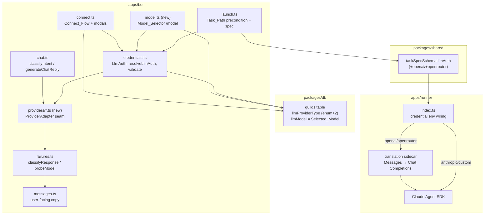

# Design Document

## Overview

AnyWareCode is a bring-your-own-LLM Discord coding agent. Every guild connects its
own credential through `/connect llm`; there is no platform key. Today the system
speaks exactly one wire protocol — the **Anthropic Messages API** (`/v1/messages`,
content blocks, `tool_use`) — on both the bot's direct-call path (`apps/bot/src/llm`)
and the runner's agent path (`apps/runner`, Claude Agent SDK). The `custom` provider
works only because it targets an *Anthropic-compatible* endpoint.

This feature adds two providers, **`openai`** (OpenAI + Codex models) and
**`openrouter`**, both of which expose the **OpenAI Chat Completions** request/response
shape, and a **model-switching** capability that changes the active model within
whichever provider a guild has configured. The central engineering problem is
reconciling two wire shapes:

| Concern | Anthropic Messages | OpenAI Chat Completions |
|---|---|---|
| Endpoint | `POST {base}/v1/messages` | `POST {base}/v1/chat/completions` |
| Auth header | `x-api-key` / `authorization: Bearer` + `anthropic-version` | `authorization: Bearer` |
| System prompt | top-level `system` | first `messages[]` item, `role:"system"` |
| Structured decision | `tools` + `tool_choice` → `content[].type==="tool_use"` | `tools`(function) + `tool_choice` → `choices[0].message.tool_calls[].function.arguments` |
| Plain reply | `content[].type==="text"` | `choices[0].message.content` |
| Soft error on 200 | `{ "type":"error" }` body | normal HTTP status codes |
| Rate-limit headers | `anthropic-ratelimit-unified-*`, `retry-after` | `x-ratelimit-*`, `retry-after` |

The design introduces a **provider-adapter seam** so every direct LLM call builds the
request and parses the response through a provider-specific adapter, while the existing
status→`FailureMode` classifier, retry, and message-builder layers stay shared. Anthropic
and `custom` behavior is held **byte-for-byte identical** by making the Anthropic adapter
a literal extraction of today's code. On the runner side, OpenAI-compatible tasks run via
a **translation sidecar** that presents an Anthropic-Messages endpoint and forwards to the
provider's Chat Completions API, so the entire existing SDK/control-plane/verify machinery
is reused unchanged (with a clear-failure fallback when translation is unavailable).

### Requirements addressed

- **Connect new providers**: Req 1 (OpenAI), Req 2 (OpenRouter)
- **Validate before persist**: Req 3
- **Model switching + provider scoping**: Req 4, Req 5, Req 10
- **Bot direct-call routing**: Req 6
- **Task/runner routing**: Req 7
- **Storage/confidentiality/removal**: Req 8
- **Status visibility**: Req 9

## Architecture



### Key decisions

1. **Adapter seam, shared classifier.** A `ProviderAdapter` owns everything
   shape-specific: endpoint+headers, request-body building (classify / reply / probe),
   and response extraction (decision / reply text / soft-error detection / rate-limit
   header parsing). The status→`FailureMode` ladder in `failures.ts` stays the single
   classifier; only its Anthropic-specific pieces (`isProviderErrorBody`,
   `parseRateLimitInfo` header names) move behind the adapter. This keeps Req 6.6's
   "map to existing failure-mode messages" guarantee while letting both shapes flow
   through one pipeline.

2. **Anthropic behavior is preserved by construction.** The `AnthropicAdapter` is a
   verbatim move of today's `buildAnthropicHeaders`, `buildClassifyRequest`,
   `findDecideBlock`, and `extractReplyText`. `anthropic_api_key`, `claude_oauth`, and
   `custom` continue to call `/v1/messages` with identical bodies and headers (Req 6.3,
   7.5).

3. **One model column, provider-scoped by configuration.** `guilds.llmModel` is reused
   as the **Selected_Model for every provider type** (not just `custom`). A guild has
   exactly one configured provider at a time, so the single column is inherently
   provider-scoped; `/connect llm` always overwrites it (Req 5.5) and `/model` only ever
   targets the configured provider (Req 5.1–5.3). `Default_Model` is a per-provider-type
   lookup used when `llmModel` is null (Req 5.4).

4. **Runner runs OpenAI-compatible providers through a translation sidecar.** Recommended
   over an alternate native engine because it reuses the SDK's subagents, control plane,
   and verify loop unchanged. The runner points `ANTHROPIC_BASE_URL` at a localhost
   translator that converts Messages↔Chat Completions. When the translator is absent or
   fails preflight, the task fails with a clear, provider-named message and no
   cross-provider fallback (Req 7.3, 7.4). Tradeoffs in *Task_Path* below.

## Components and Interfaces

### 1. Provider adapter seam (`apps/bot/src/llm/providers/`)

```ts
// providers/types.ts
export interface ProviderAdapter {
  /** Endpoint + auth headers for this credential (no content-type). */
  endpoint(auth: LlmAuth): { url: string; headers: Record<string, string> };

  /** Effective model for the call: Selected_Model when set, else Default_Model. */
  effectiveModel(auth: LlmAuth, fallbackModel: string): string;

  /** Build the structured-classification request body for the wire shape. */
  buildClassifyBody(model: string, ctx: ChatContext): unknown;
  /** Build the free-form reply request body. */
  buildReplyBody(model: string, ctx: ChatContext): unknown;
  /** Build the smallest valid credential/model probe body (Req 3.1). */
  buildProbeBody(model: string): unknown;

  /** Extract a structured intent decision, or null when none is present (Req 6.4/6.5). */
  extractDecision(body: unknown): IntentDecision | null;
  /** Extract the joined assistant reply text (Req 6.2). */
  extractReplyText(body: unknown): string;

  /** True when a 200 body actually encodes a provider error (Anthropic soft error). */
  isProviderErrorBody(body: unknown): boolean;
  /** Parse provider-specific rate-limit headers into the shared RateLimitInfo. */
  parseRateLimitInfo(args: { headers: HeaderGet; receivedAtMs: number }): RateLimitInfo;
}

export function adapterFor(auth: LlmAuth): ProviderAdapter; // dispatch on auth.type
```

- `AnthropicAdapter` — covers `anthropic_api_key`, `claude_oauth`, `custom`. Bodies and
  header logic are lifted unchanged from `credentials.ts`/`chat.ts`. `extractDecision`
  reuses `findDecideBlock` + `intentDecisionSchema`.
- `OpenAiCompatibleAdapter` — covers `openai`, `openrouter`. Differences are only the
  base URL (`api.openai.com` vs `openrouter.ai/api`) and headers, so a single
  implementation parameterized by base URL serves both.

OpenAI-compatible request bodies:

```ts
// classify: function calling, forced
{
  model,
  max_tokens: 1024,
  messages: [
    { role: "system", content: SYSTEM_PROMPT },
    { role: "user", content: renderContext(ctx) },
  ],
  tools: [{ type: "function", function: { name: "decide", parameters: DECIDE_JSON_SCHEMA } }],
  tool_choice: { type: "function", function: { name: "decide" } },
}
// reply: plain completion
{ model, max_tokens: 4096, messages: [ {role:"system",...}, {role:"user", content: renderContext(ctx)} ] }
// probe: smallest accepted payload (Req 3.1)
{ model, messages: [{ role: "user", content: "hi" }], max_tokens: 1 }
```

`renderContext`, `SYSTEM_PROMPT`, `intentDecisionSchema`, and the `decide` parameter
schema are **shared** — only the envelope differs. `extractDecision` for OpenAI reads
`choices[0].message.tool_calls[0].function.arguments` (a JSON string), `JSON.parse`es it
(guarded), and validates against `intentDecisionSchema`; on any miss it returns `null`.

### 2. `chat.ts` — direct calls through the adapter (Req 6)

`buildClassifyRequest`, `classifyIntent`, and `generateChatReply` change from calling
`buildAnthropicHeaders` directly to `const a = adapterFor(auth)` and delegating body
build + extraction. The conformance predicates become adapter-driven:

- classify conformant ⇔ `a.extractDecision(body) !== null`
- reply conformant ⇔ `a.extractReplyText(body).length > 0`

`classifyResponse` keeps the status ladder but takes the adapter's `isProviderErrorBody`
and a `validate` predicate, exactly as today. The 60s timeout (`CLASSIFIER_TIMEOUT_SECONDS`)
and `fetchWithTimeout` are unchanged (Req 6.7).

**Classification fallback (Req 6.5).** When `classifyIntent` gets a 200 but
`extractDecision` returns `null` (empty body, unparseable, no `tool_calls`, missing
`action`), the caller does not launch a task. The mention handler already treats a failed
classify by replying; we make the fallback explicit: a `null` decision maps to
`{ action: "reply", reply_text: <assistant message content if any, else a safe default> }`
so downstream routing is identical to an Anthropic `reply` decision (Req 6.4).

### 3. Credential validation (`credentials.ts`, Req 3)

`validateLlmAuth(auth)` becomes adapter-driven: it uses `adapter.endpoint(auth)` +
`adapter.buildProbeBody(effectiveModel)` under a **10s** `AbortController` timeout
(Req 3.2). Outcome mapping is unchanged in spirit:

- `401/403` → `{ ok:false, reason:"Authentication failed…" }` (Req 3.3)
- `200` or `400` (param error, but credential authenticated) → `{ ok:true }` (Req 3.4)
- abort/timeout/transport → `{ ok:false, reason:"Connection failed…" }` (Req 3.5)
- The reason strings never include the token or any auth header (Req 3.6, 8.2).

### 4. Connect_Flow (`connect.ts`, Req 1, 2, 8)

- `llmChooserMessage` gains two buttons: `aw:llm:openai`, `aw:llm:openrouter`.
- `handleLlmButton` registers two modal builders. Each modal collects an **API key**
  field and a **model** field:
  - OpenAI: key 1–512 chars, model 0–256 chars (Req 1.2).
  - OpenRouter: key ≤512, model ≤200 (Req 2.2); empty key rejected at submit (Req 2.7).
- `handleLlmModal` adds `openai`/`openrouter` branches that build the new `LlmAuth`
  variants, validate (Req 3), and on success persist `llmProviderType`, encrypted
  `llmCredentialEnc`, `llmModel = trimmedModel || defaultModelFor(type)` (Req 1.6, 2.6),
  `llmBaseUrl = null`, and `llmCredentialSetAt = now` (Req 1.4, 2.4). Admin gate is the
  existing `ManageGuild` check (Req 1.5, 2.5).
- **Removal with bounded retry (Req 8.4–8.6).** The remove path clears
  `{llmProviderType, llmCredentialEnc, llmBaseUrl, llmModel, llmCredentialSetAt}`, then
  re-reads the row; if any field is still set it retries the clear up to **3 additional**
  times. If still dirty, it reports the removal was incomplete and treats the guild as
  unconfigured.

### 5. Model_Selector (`apps/bot/src/discord/model.ts` — new, Req 4, 5, 10)

A new admin-gated `/model` slash command (`setDefaultMemberPermissions(ManageGuild)`):

- **No option** → ephemeral status: configured provider + effective model, plus a
  "Change model" button (Req 4.1, 9). If no provider configured → instruct `/connect llm`
  (Req 4.3).
- **Change** → modal with a single model field (1–200 chars). On submit:
  1. Trim; reject empty/whitespace or >256 chars, retaining the previous model (Req 5.6,
     10.1).
  2. Validate the model against the configured provider via `probeModel` (adapter-aware)
     under a 10s timeout (Req 10.2, 10.3).
  3. On a model-unavailable signal → reject, retain previous, "model is unavailable"
     (Req 10.2). On timeout/other failure → reject, retain previous, "could not be
     validated" (Req 10.3).
  4. On success → write `llmModel` only; leave `llmProviderType`, credential, and
     `llmCredentialSetAt` untouched (Req 4.2), and confirm by naming the new model
     (Req 4.5). Every rejection states its reason (Req 10.4).
- Non-admin invocation is rejected with no state change (Req 4.4).
- No tier/paywall/cap checks are applied (Req 4.6).

Model-availability detection: a `400`/`404` whose body indicates an unknown/unavailable
model maps to "unavailable" (Req 10.2); auth/timeout/network map to "could not be
validated" (Req 10.3). The adapter exposes a small `isModelUnavailable(status, body)`
helper so both wire shapes classify consistently.

### 6. Task_Path / runner (Req 7)

`resolveLlmAuth` returns the new variants carrying `{ token, model }` where `model` is the
effective model (Selected_Model ?? Default_Model). `launchTask` / orchestrator pass these
straight into `taskSpec.llmAuth` (the shared schema is extended). The runner's
`index.ts` credential-wiring switch gains `openai`/`openrouter` arms.

**Recommended mechanism — translation sidecar.** The runner image bundles a lightweight
Messages→Chat-Completions translator (e.g. a LiteLLM-style proxy or a small in-process
translator) listening on `127.0.0.1`. For an OpenAI-compatible task the runner sets:

```
ANTHROPIC_BASE_URL = http://127.0.0.1:<port>   # translator
ANTHROPIC_AUTH_TOKEN = <provider key>          # forwarded upstream
ANTHROPIC_MODEL = <effective model>
```

and the existing `ClaudeAgent` runs unchanged. The translator maps the SDK's Messages
requests (including `tool_use`/`tool_result`) onto Chat Completions function calls and back.

- *Why this approach*: zero changes to `ClaudeAgent`, subagents, the host control plane
  (`set_model`, `interrupt`, `set_mode`), and the verify/repair loop; OpenAI and OpenRouter
  share it; symmetrical with how `custom` already reuses the SDK via `ANTHROPIC_BASE_URL`.
- *Tradeoffs*: translation fidelity for tool-call/streaming edge cases is the main risk;
  model-specific quirks (e.g. `max_completion_tokens`) live in one place; an extra process
  in the image. The alternative — a native OpenAI agent engine behind the `Agent` seam
  (like `ClawAgent`) — avoids translation but forgoes SDK subagents/control-plane and
  doubles the agent-loop surface to maintain, so it is the fallback, not the default.

**Preflight + clear failure (Req 7.3, 7.4).** `preflight.ts` gains arms for
`openai`/`openrouter`: assert the translator base URL and `ANTHROPIC_MODEL` are set and the
model id is well-formed (no `claude-` check for these types). If preflight fails or the
translator is unreachable, the task is marked failed and the bot posts a message **naming
the configured provider** ("Couldn't run this task on your configured **OpenAI** provider…"),
persists no partial result, and never retries on another provider or model.

### 7. Status visibility (Req 9)

`handleSetupCommand` and `/llm-status` render `providerTypeLabel(llmProviderType)` plus the
effective model (`llmModel ?? defaultModelFor(type)`); when neither exists, show "no model
configured" (Req 9.4). A decrypt failure or read error reports the unreadable/unavailable
state and treats the guild as unconfigured (Req 8.3, 9.6). No credential material appears
in any status output (Req 9.5).

## Data Models

### Provider enum + credential columns (`packages/db/src/schema.ts`)

```ts
llmProviderType: text("llm_provider_type", {
  enum: ["claude_oauth", "anthropic_api_key", "custom", "openai", "openrouter"],
}),
// llmCredentialEnc, llmBaseUrl, llmCredentialSetAt: unchanged.
// llmModel: now the Selected_Model for EVERY provider type (was custom-only).
```

A Drizzle migration adds the two enum values (Postgres `ALTER TYPE … ADD VALUE` or a
text-column check widening) — additive and backward-compatible; existing rows keep their
values and their `llmModel` semantics (custom rows already populate it).

### `LlmAuth` union (bot `credentials.ts` and shared `index.ts`)

```ts
export type LlmAuth =
  | { type: "anthropic_api_key"; token: string }
  | { type: "claude_oauth"; token: string }
  | { type: "custom"; token: string; baseUrl: string; model: string }
  | { type: "openai"; token: string; model: string }       // NEW
  | { type: "openrouter"; token: string; model: string };   // NEW
```

Shared `llmAuthSchema` (drives `TaskSpec`) gains the two discriminated-union members with
`token: z.string().min(1)` and `model: z.string().min(1)`. Old runners ignore unknown
fields; a new runner rejects an OpenAI-compatible task only via preflight, never silently.

`resolveLlmAuth` adds branches: for `openai`/`openrouter` it decrypts the token and returns
`{ type, token, model: guild.llmModel ?? defaultModelFor(type) }`. Decrypt failure keeps
today's behavior — abort, treat as unconfigured, instruct reconnect (Req 8.3).

### Default model resolution

```ts
// providers/defaults.ts
export function defaultModelFor(type: LlmAuth["type"], cfg: Config): string {
  switch (type) {
    case "openai":     return cfg.OPENAI_DEFAULT_MODEL;      // e.g. "gpt-4o-mini"
    case "openrouter": return cfg.OPENROUTER_DEFAULT_MODEL;  // e.g. "openrouter/auto"
    case "custom":     return /* the row's model */;
    default:           return cfg.DEFAULT_MODEL;             // Anthropic
  }
}
```

New config keys `OPENAI_DEFAULT_MODEL` and `OPENROUTER_DEFAULT_MODEL` (with sensible
defaults) join `config.ts`.

### Effective model (single definition, used everywhere)

```
effectiveModel(guild) = (guild.llmModel?.trim() || null) ?? defaultModelFor(guild.llmProviderType)
```

Chat_Path, Task_Path, validation, and status all compute the effective model this way, so
Req 6.1, 7.1, 9.2 share one rule.

## Correctness Properties

*A property is a characteristic or behavior that should hold true across all valid
executions of a system — essentially, a formal statement about what the system should do.
Properties serve as the bridge between human-readable specifications and machine-verifiable
correctness guarantees.*

The properties below are derived from the prework classification. UI-rendering, timeout,
authorization-gate, and runner-integration criteria are covered by example/integration
tests in the Testing Strategy rather than properties. Redundant criteria were consolidated
during property reflection (e.g. the three provider-scope criteria collapse to one
isolation property; all secret-exclusion criteria collapse to one invariant).

### Property 1: Connect persists the submitted-or-default model, overwriting any prior

*For any* prior guild state, any new provider type, and any submitted model string,
completing the Connect_Flow stores `llmModel` equal to the submitted model trimmed of
surrounding whitespace when that trimmed value is non-empty, and equal to that provider
type's Default_Model otherwise — never the previously stored model — and stores
`llmProviderType` equal to the chosen type.

**Validates: Requirements 1.3, 1.6, 2.3, 2.6, 5.5**

### Property 2: Whitespace-only API key is rejected with no persistence

*For any* string composed entirely of whitespace submitted as an OpenRouter (or OpenAI)
API key, the Connect_Flow rejects the submission, persists no credential field, and
returns a message stating an API key is required.

**Validates: Requirements 2.7**

### Property 3: Credential validation uses the minimal Chat Completions shape and gates persistence

*For any* OpenAI-compatible credential, the validator issues exactly one request whose
body is the OpenAI Chat Completions minimal payload (a single user message with a minimal
token cap) to the provider's `/v1/chat/completions` endpoint, and the credential is
persisted only when validation returns success.

**Validates: Requirements 3.1**

### Property 4: Validation status classification (auth-fail vs authenticated)

*For any* validation response status, a `401` or `403` yields rejection with no
persistence, while a `200` or a `400` (parameter error that nonetheless authenticated)
yields acceptance and persistence.

**Validates: Requirements 3.3, 3.4**

### Property 5: Secret-exclusion invariant across all user-facing output

*For any* credential token, no user-facing string the system can emit — validation
responses, chat-path and task-path failure messages, Model_Selector responses, and status
output — contains the token value or its `Bearer <token>` authorization-header form.

**Validates: Requirements 3.6, 8.2, 9.5**

### Property 6: Model switch is provider-scoped and mutates only the Selected_Model

*For any* configured guild state and any accepted new model identifier, the Model_Selector
writes only `llmModel`, leaving `llmProviderType`, the stored credential, the base URL, and
the credential-set timestamp unchanged; consequently a switch never alters the model
resolution rules of any provider type other than the configured one.

**Validates: Requirements 4.2, 5.1, 5.2, 5.3**

### Property 7: Effective-model resolution

*For any* configured provider type and any nullable stored model, the effective model
equals the stored model trimmed when that trimmed value is non-empty, and the provider
type's Default_Model otherwise.

**Validates: Requirements 5.4**

### Property 8: Confirmation names the new model

*For any* accepted model identifier, the Model_Selector success response contains the
trimmed model identifier that was persisted.

**Validates: Requirements 4.5**

### Property 9: Syntactically invalid model is rejected and the previous selection retained

*For any* model identifier that is empty, whitespace-only, or longer than 256 characters
after trimming, the Model_Selector rejects the change, leaves the stored Selected_Model
unchanged, and returns a response stating the reason.

**Validates: Requirements 5.6, 10.1, 10.4**

### Property 10: Provider-reported unavailable model is rejected with the unavailable reason

*For any* validation outcome in which the provider reports the model unavailable to the
credential within the time limit, the Model_Selector rejects the change, retains the
previous Selected_Model, and responds that the model is unavailable.

**Validates: Requirements 10.2**

### Property 11: Each adapter builds its provider's request shape carrying the effective model

*For any* chat context and effective model, the OpenAI-compatible adapter produces a Chat
Completions request body (system-as-first-message, forced `decide` function tool for
classification) and the Anthropic adapter produces a Messages request body (top-level
`system`, `decide` tool), each carrying the effective model.

**Validates: Requirements 6.1, 6.3**

### Property 12: Reply extraction reads the provider's response shape

*For any* successful provider response, the adapter extracts the assistant reply from that
provider's shape — `choices[0].message.content` for OpenAI-compatible, joined `text`
blocks for Anthropic.

**Validates: Requirements 6.2**

### Property 13: Classification routing equivalence across providers

*For any* valid intent decision, encoding it into an Anthropic `tool_use` body and into an
OpenAI `tool_calls` body and extracting through the respective adapter yields equal
`IntentDecision` values, so downstream task routing is identical regardless of provider.

**Validates: Requirements 6.4**

### Property 14: Malformed classification response falls back to a reply

*For any* OpenAI-compatible response that is empty, unparseable, or missing the required
decision attribute, decision extraction yields `null` and the classify path resolves to a
conversational reply rather than launching a task.

**Validates: Requirements 6.5**

### Property 15: Non-success responses map to an existing failure-mode message

*For any* non-success response status, classification yields exactly one of the five
existing `FailureMode` categories and the message-builder returns a non-empty message from
that category's existing copy rather than a generic failure string.

**Validates: Requirements 6.6**

### Property 16: Resolved task auth carries provider type, credential, and effective model

*For any* configured OpenAI-compatible guild, the authentication resolved for the Task_Path
carries the provider type, the decrypted token, and the guild's effective model.

**Validates: Requirements 7.1**

### Property 17: Unrunnable OpenAI-compatible task names the provider and persists nothing

*For any* OpenAI-compatible provider type, when the runner cannot execute the task the
user-facing failure message names that configured provider type and no partial task result
is persisted.

**Validates: Requirements 7.3**

### Property 18: Credential encryption round-trip is guild-bound

*For any* token and guild id, decrypting the per-guild AES-256-GCM ciphertext produced for
that token and guild returns the original token, and attempting to decrypt it under a
different guild id fails (returns null) rather than yielding a usable credential.

**Validates: Requirements 8.1**

### Property 19: Undecryptable credential is treated as unconfigured

*For any* stored blob that fails to decrypt, credential resolution returns no auth and a
reason instructing the admin to reconnect via `/connect llm`, and never falls back to a
partial credential.

**Validates: Requirements 8.3**

### Property 20: Bounded-retry credential removal

*For any* store that leaves a credential field set on up to 3 attempts and then succeeds,
removal ends with all five credential fields cleared in at most 4 total attempts and
confirms removal; *for any* store that always leaves a field set, removal stops after 4
attempts, reports the removal was incomplete, and treats the guild as unconfigured.

**Validates: Requirements 8.4, 8.5, 8.6**

## Error Handling

The five-category `FailureMode` taxonomy (`rate_limited`, `auth_failed`, `overloaded`,
`model_error`, `network_error`) and the `classifyResponse` status ladder are reused as the
single mapping for both wire shapes (Req 6.6). Adapter-specific hooks feed it:

- **Soft errors on 200.** Anthropic's `{ "type":"error" }` body is detected by
  `AnthropicAdapter.isProviderErrorBody`; OpenAI-compatible providers signal errors with
  HTTP status, so `OpenAiCompatibleAdapter.isProviderErrorBody` returns `false` and the
  status ladder governs.
- **Rate-limit headers.** `OpenAiCompatibleAdapter.parseRateLimitInfo` reads
  `x-ratelimit-reset-*` / `retry-after`, normalizing into the shared `RateLimitInfo`
  (clamped to `receivedAtMs`, status truncated) so `messages.ts` renders identical copy.
- **Classification fallback (Req 6.5).** A 200 whose body yields no decision is not an
  error — it deterministically becomes a `reply`, never a task launch.
- **Validation/probe failures (Req 3, 10).** `401/403` → auth failure copy;
  abort/timeout/transport → connection-failed copy; a model-unavailable signal in the
  Model_Selector → "unavailable", other failures → "could not be validated".
- **Decrypt failure (Req 8.3).** `resolveLlmAuth` returns `{ auth:null, reason }`; the
  guild is treated as unconfigured everywhere downstream. No partial credential is used.
- **Removal exhaustion (Req 8.6).** After 4 failed clear attempts the admin is told the
  removal is incomplete and the guild is treated as unconfigured.
- **Runner failure (Req 7.3, 7.4).** Preflight or translator failure marks the task failed
  with a provider-named message, persists no partial result, and never retries on another
  provider or model.
- All failure strings pass through `sanitizeUserMessage` (mention-safe, length-bounded)
  and, by construction, exclude credential material (Property 5).

## Testing Strategy

### Property-based tests

PBT applies: the adapters, validators, resolvers, and message-builders are pure functions
with large input spaces (arbitrary model strings, tokens, statuses, response bodies,
intent decisions, guild states). Properties 1–20 above are each implemented as a single
property-based test using **fast-check** (already the workspace's JS PBT choice), minimum
**100 iterations**, with `fetch`, the clock, and the DB store injected as fakes so no
network or real database is touched.

- Each test is tagged: `// Feature: multi-provider-model-switching, Property {n}: {text}`.
- Generators: arbitrary model identifiers (incl. whitespace-only and >256-char), arbitrary
  tokens (incl. ones embedded in error bodies), HTTP status arbitraries spanning the
  ladder, well-formed and malformed Chat Completions / Messages bodies, and arbitrary
  `IntentDecision` values for the routing-equivalence property.
- The secret-exclusion property (5) generates a token, drives every output-producing path,
  and asserts the token (and its `Bearer` form) never appears in any returned string.

### Unit (example) tests

For the criteria classified EXAMPLE: chooser includes OpenAI/OpenRouter options (1.1, 2.1);
modal field limits (1.2, 2.2); credential-set timestamp written from an injected clock
(1.4, 2.4); non-admin gating for connect and `/model` (1.5, 2.5, 4.4); 10s validation and
60s classify timeouts via a never-resolving fake fetch (3.2, 3.5, 6.7, 10.3); unconfigured
`/model` instructs reconnect (4.3); no billing/cap check on switch (4.6); status renders
provider/effective-model/none/no-model-configured and could-not-retrieve (9.1–9.4, 9.6);
no cross-provider fallback on runner failure (7.4); Anthropic/`custom` env wiring is a
golden match to today (7.5).

### Integration tests

For runner execution against an OpenAI-compatible provider through the translation sidecar
(7.2): 1–3 representative runs (one OpenAI, one OpenRouter, one translator-down →
clear-failure) verifying base-URL/model wiring and the clear-failure path. These are not
property tests — behavior does not vary meaningfully with input and the cost per run is
high.

### Backward-compatibility guard

A golden test asserts `AnthropicAdapter` produces byte-identical request bodies/headers to
the current `buildAnthropicHeaders`/`buildClassifyRequest` for `anthropic_api_key`,
`claude_oauth`, and `custom`, and that the runner credential-env switch is unchanged for
those types (Req 6.3, 7.5).
